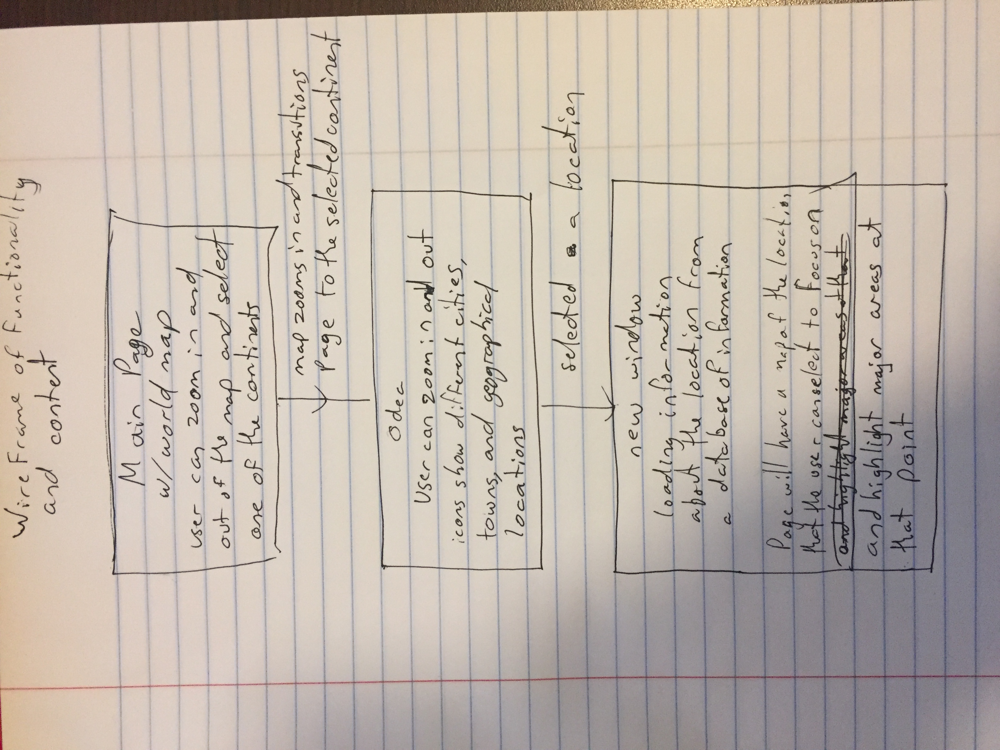

# Abhoren-Website

The goal of this project it to create an interactive map for a fantasy world the team has created called Abhoren. The website will feature the whole world map with each of the continents and island nations. The user will be able to zoom into the map to discover different areas of the world.

After zooming in the goal is to have sections of the map marked where the major geographical landmarks are and where each city is. After clicking, a new window will open detailing information about either the marker or region they clicked. This information will include but is not limited to, the name of the area, climate, religion, what kinds of people reside in the area, history of the area, and any important figures who live here.

Our first major milestone in this project is to have the first continent (the west-most), Odea, working. This entails markers for the landmarks, cities, towns, and relevant information after clicking. This also requires a database-style collection of all the important features of the land so that after clicking the user will be able to view the information.

# Responsibilities

Matthew Paseltiner: 
For this project I will be working with the LeafletJS library and the MapboxJS library to import a custom map and tileset for each landing page to the project. This requires a little bit of outside work making tile sets of images at different zoom levels and then adding them to the website. LeafletJS and MapboxJS are primarily designed to work with real world maps that have already been made similar to google maps so it requires some extra work to get everything functional. And finally I will be helping Conor create the database of information that the user will be able to access when they select one of the major cities, towns or major geographical location.

The major thing that I will need to learn is how to turn a large map into a tileset that is useable by LeafletJS and MapboxJS and is able to have multiple zoom levels. Then I will need to learn how to work with LeafletJS and MapboxJS to implement a custom map and not one of the prebuilt maps that are easy to implement.

Conor Lilley:
For this project I will be doing most of the main HTML and CSS needed for this project to work. I will be implementing LeafletJS and MapboxJS to create markers for each landmark, city, or feature. I also will be using these javascript libraries to enable zooming/clicking on the map and using these clicks to further give information using the database. Finally I will be doing much of the database with help from Matthew. I will need to learn how to implement these javascript libraries and also utilize them to correctly complete all tasks that need to be done.

# Above and Beyond for the first project

The User will be able to take an empty map of a continent and draw on it.

# Future Goals

We eventually plan to have the entire world mapped with every continent finished with relevant pages on the database.

# JS Libraries

For this project we are utilizing several javascript libraries

<a href = "https://jquery.com">JQuery:</a>
We will be using the jQuery API to enable easier document traversal, manipulation, and event handling.

<a href = "https://github.com/Leaflet/Leaflet">Leaflet.js:</a>
We will be using leaflet to make the interactive map of our world

<a href = "https://www.mapbox.com/mapbox.js/api/v3.1.1/">Mapbox.js:</a>
Mapbox is a plugin of leaflet and we will be using it to make our map look better and to be able to utilize our original map for Abhoren

<a href = "https://github.com/Turbo87/leaflet-sidebar">Leaflet-sidebar.js:</a>
Leaflet-sidebar is a plugin of leaflet that implements a sidebar nav to pop out the side of the screen. It allows us to display information easily to the viewer. 

# Surface Design

Above is the world map of Abhoren that the team has been working on. This will serve for the landing page of the website and the first page of interactivity. The user will be able to zoom in and out on the map and select one of the continents or island nations to focus on. For now we will only implement the western continent, Odea.

Above is an example of the kind of information popup we want when the user selects one of the cities, towns or major geographical locations. Loremaps has been an incredible source of inspiration and guidance on this project.

Above is the wireframe with the content, functionality and how the different pages connect to each other.
